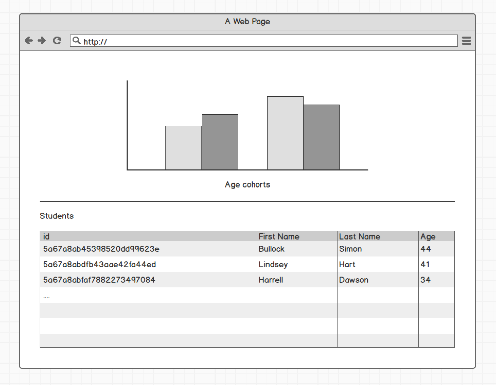

# Introduction

Dear Developer,

This task not only covers some of the technologies and frameworks we use at work, but also a rough list of requirements. Understanding the requirements is as much part of the task as finding a good solution to the problem.
Please choose the options for solving the tasks. When in reasonable doubt regarding the task or the requirements, also feel free to call us.

It is possible that you will not be able to solve this problem in a super perfect way, and that is fine. Many one of the technologies involved take much more time to master than what could be expected as an investment into such a task. We expect that you will have to spend 16 to 24 hours for solving this task. If you solve it quicker, that is totally fine as well. In any case we would like to get a rough insight into how you went about solving this problem:

- Where did you pick up information
- What were challenges that you faced
- At what point did you finish your task, what would have been next steps, had you had more time to invest into this task

There are a couple of tools we expect you to use.

- git vor getting this, and for commiting the result. 
- node and npm. Please consider the ````package.json```` file in here relevant. Feel free to add to it, too.
- d3 for visualizing the data
- Markdown for writing the documentation
- html, js, css, obviously

You can use all the libraries in the world if they seem a good fit for solving the problem at hand. The ones you use, make sure we are aware of them through the package.json file. And obviously, you can use the internet to find solutions to your problem. But do expect to get asked about your understanding the solutions you implement.

Please use the file index.html as your entry point. Feel free to add other files, if suitable.

When done, please send a zip file of the repository via mail to us. You cannot push your solution into the repo.

# The task: A D3 bar chart which is also a filter

Please create a web application which fulfills the following requirements:

1. Load the file data.json and put the content into a js array.
2. Display the data in two ways: first in a normal html table, second in a bar chart.<br>Please build a bar chart using __d3js__ from the data. The bar chart should represent the cohorts of students along their age. The age cohorts are: 

- \> 30
- 31-35
- 36-40
- 41-45
- 56-50
- \> 50



3. Turn the bar chart into a filter: When a user clicks a bar, display only the values corresponding to that bar, i.e. only the line which belong to the selected age cohort. Highlight the active filter in the bar chart.
4. Document your code inside the code, and write a short summary into the file myjourney.md. 
5. Submit your solution back to the git repository